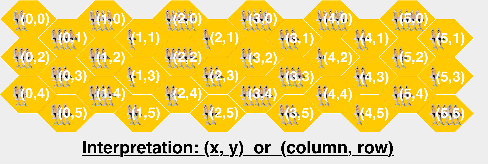

*Dadiel Hantoro & Yu Lin*
# - Fish 
## General
### Roadmap:
    | Fish
    | Planning
    |   | milestons.pdf
    |   | system.pdf
    |   | self-1.pdf
    |   | game-state.md
    |   | self-2.pdf
    |   | games.pdf
    | Common
    |   | state.java   
    |   | Fish
    |   |   | Fish.iml
    |   |   | Fish.png   
    |   |   | Pom.xml 
    |   |   | target/
    |   |   | src
    |   |   |   | Main.java  
    |   |   |   | xboard.java 
    |   |   |   | META-INF
    |   |   | controllers
    |   |   |   | FishController.java
    |   |   | models
    |   |   |   | FishGameState.java
    |   |   |   | FishModel.java 
    |   |   |   | Tile.java
    |   |   |   | Player.java 
    |   |   |   | Penguin.java 
    |   |   |   | PenguinColor.java
    |   |   | views
    |   |   |   | FishView.java 
    |   |   |   | TilesPanel.java   
    |   |   | test
    |   |   |   | FishControllerMock.java 
    |   |   |   | FishControllerMockTest.java 
    |   |   |   | FishGameStateTest.java 
    |   |   |   | FishModelTest.java
    |   |   |   | TileTest.java 
    |   |   |   | PlayerTest.java
    |   |   |   | PenguinTest.java 

### Test

#### xtest:

Location:

    ./Fish/xtest

To run the xtest in console:

    ./xtest

#### JUnit tests directory:

    Fish/Common/Fish/test/

#### Testing with Maven:
To install Maven:

    mvn clean install

To run entire test suite:

    mvn test

To run single/specific test(s):

    mvn -Dtest=TestClassName test

#### Testing in a IDE:
1. Clone the project & set up the SDK in your favorite IDE.
2. Run conmmand: $ mvn clean install
3. Locate the test files where you can run single tests or the entire classes of tests.

#### Test Result:
Tests run: 43, Failures: 0, Errors: 0, Skipped: 0

## Milestones
### 2 — The Game Pieces
In the first assignment we designed and implemented data representations of tiles and boards plus visual representations of fish and penguins (penguins are represent as circles). The board representaion now has the following pieces of functionality:
* creating a board that has holes in specific places and is set up with a minimum number of 1-fish tiles;
* creating a board that has the same number of fish on every tile and has no holes
* determining the positions reachable via straight lines from a given position
* removing a tile from a board; and
* rendering a the tiles graphically.

#### Board Indexing
x position represents the column number, y position represents the row number on the fishboard. Refer to the graph below:

#### GUI & Running in Console
Main method can take in the inputs for generating the model, the valid sequence of inputs are: 
1. Width - Positive integer.
2. Height - Positive integer larger than 1.
3. MinOneFishNumOrFishNumOnTiles (stands different thing depends on the fourth argument):
    -  Minimum number of one-fish tiles - Positive integer range from 0 to Width * Height. (Random Mode)
    - Number of fishes on each tiles - Positive integer range from 1 to 5. (Nonrandom Mode).
4. RandomModeOrNonRandom:
    - Random mode will have a minimum number of one-fish tiles, fish number on other tiles are randomly distributed from 2 to 5 - "random"
    - Nonrandom mode will have each tiles containing the same fish number. - "nonrandom".

Then it opens for user to input the tiles that they want to empty, valid sequence of inputs are"
1. x position of the tile - Natural Number
2. y position of the tile - Natural Number

When finished emptying the tiles, input the following command to show the GUI:

    -run

GUI is generated through our Model/View/Controller (MVC) design pattern, which the controller takes care of the work between model and view, the model handles the logic, and the view draws the GUI components.

### 3 - The Game State
A game state represents the current state of a game: the state of the board, the current placements of the penguins, knowledge about the players, and the order in which they play.

A game state representation may be used by the referee component to perform turns and check rule-conforming behavior. A player component can use it for planning purposes.

The game-state representation come with the following pieces of functionality:

- creating a state for a certain number of players;

- place an avatar on behalf of a player;

- move an existing avatar from one spot to another on behalf of the player;

- determine whether any player can move an avatar; and

- rendering the state graphically.

#### Implementations

    FishGameState

The FishGameState class stores the FishModel, which is a game board class of the fish game. Board is an ArrayList of ArrayList of Tile that is taken from the FishModel. playersSortedByAgeAscend is the sorted array of Player by age. penguinsOnBoard is an empty ArrayList of Penguin that will be populated in the FishGameState. currentPlayerNum is the current index of the player, which starts from 0. totalPlayerNum is the total number of players that will be playing in this tournament. To consturct the class, it takes in a FishModel and a ArrayList of Players.

    Player

Player representation of the user who is playing the fish game, which has 3 parameters: age, totalFish, penguinColor. Age is used for determine the order of round robin player turns. TotalFish represents the total number of fishes the player have got in a game. PenguinColor differentiate each player within each game, and their avatars. 

    Penguin
A penguin's visual representation can be shown now as circles with different colors based on their PenguinColor.

#### Test Harness

The harness consumes its JSON input from STDIN and produces its results to STDOUT. The tests are formulated as pairs of files: \<n>-in.json, the input, and \<n>-out.json, the expected result, for an integer \<n> ranged from 1 to 3.

Input: 

    Board-Posn is

      { "position" : Position,

        "board" : Board}
Its inputs is an object with two fields:

    Board is a JSON array of JSON arrays where each element is

    either 0 or a number between 1 and 5.

      The size of the board may not exceed a total of 25 tiles.

    *INTERPRETATION* A 0 denotes a hole in the board configuration. All other

    numbers specify the number of fish displayed on the tile.

    

    Position is a JSON array that contains two natural numbers:

      [board-row,board-column].

    INTERPRETATION The position uses the computer graphics coordinate system

      meaning the Y axis points downwards. The position refers to a tile with at least one fish on it.

Its expected outputs: 
    
    the number of tiles on the board that can be reached from the specified position.

Executable Location:

    annetta/3/xboard

Tests Files Location:

    annetta/3/Tests/<n>-in.json, <n>-out.json

##### Running example:
In console:

    cat ./Tests/1-in.json | ./xboard

Output:

    2